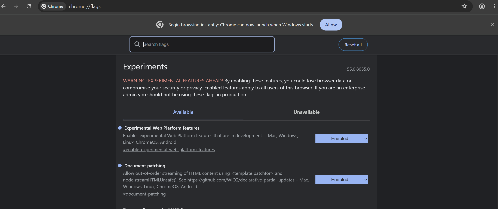

# gist-in

This *gist-in* package provides:

1.  An exportable module that JS-based web servers and JS-based build tools can use to embed a github based gist of html (and js, css, json phase II) into an html stream for optimal performance, as long as the gist responds in a timely manner. [Phase II]
2.  A fallback element enhancement similar to [pipe-in](https://github.com/bahrus/pipe-in) to request the gist resource in the browser client, and to patch the HTML with the delayed content.  In fact, gist-in is a very thin wrapper around pipe-in.

Note that github's gists play very nicely from a CORS point of view, so rest assured that should not impose any browser issues.

We make heavy use of [declarative partial updates](https://developer.chrome.com/docs/web-platform/declarative-partial-updates), both in spirit and in use of upcoming api's.

```html
<select>
<?marker name="options">
</select>


...

<!-- bottom of the page, typically -->

<template gist-in="gist://bahrus/3c9ed8541984b8cd38bc848edacf741a/raw/90e8c7ebfa3f63948f380d44d40b2663d19919e2/test.html" gist-in-for="options" gist-in-method="setHTMLUnsafe"></template>
```

`gist-in-method="setHTMLUnsafe"` is needed here — see [Sanitizing](#sanitizing)
below for why, and why the URL above is a `gist://` USL rather than a plain
`https://gist.githubusercontent.com/...` one.

\<?start> and \<?end> markers would also be supported.

To enable this feature, set the following flags in Chrome Canary.



## Why comment markers?  Why not indicate the target with a (custom) element

1.  For an alternative to comment markers to be viable, it must be placeable anywhere.  Only the template and script elements can be placed anywhere in the DOM without violating HTML decorum and/or having unexpected side effects, and using these elements (template, script) as place holders for where to insdert content isn't really semantic.
2.  It aligns with how the platform envisions partially updating pages, as the link above indicates.  Hopefully, perhaps, in the future, the platform will provide easier API hooks to find such things, since it needs such abilities to implement its own requirements.
3.  This enhancement is designed to lean on the platform where it can based on the newly minted syntax.

Searching for such markers can be rather taxing, requiring perhaps a TreeWalker (or xpath), so a helper optimizer attribute should be supported that allows for a css query, that is expected to point to the parent of the marker(s):

```html
<select>
<?marker name="options">
</select>


<template gist-in="https://gist.githubusercontent.com/bahrus/3c9ed8541984b8cd38bc848edacf741a/raw/90e8c7ebfa3f63948f380d44d40b2663d19919e2/test.html" gist-in-for="options" gist-in-for-hint="body select"></template>
```


I'm thinking the template could be removed after serving its purpose.

For now, this would always apply the standard, ["safe" sanitizing that pipe-in defaults to](https://github.com/bahrus/pipe-in#security).

Searching is done within the element.getRootNode(), so templates inside shadow Roots would only replace markers inside the shadow root.

## Sanitizing

The platform's *default* sanitizer is stricter than it might look — verified
directly, it strips `<option>` elements entirely (not just leaves them
unstyled), which breaks the flagship example above unless you opt out of it.
gist-in exposes the same two escape hatches [pipe-in
documents](https://github.com/bahrus/pipe-in#security), named and gated the
same way:

- **`gist-in-method="setHTMLUnsafe"`** (default `"setHTML"`) — named after,
  and choosing between, the two real underlying methods, the same way
  pipe-in's own `[base]-method` selects one of its `streamHTML` /
  `streamHTMLUnsafe` / etc. `setHTMLUnsafe` skips sanitizing entirely. This is
  what the flagship example above actually needs to keep its `<option>`s.
- **`gist-in-sanitizer='{"elements": ["option", "optgroup"]}'`** — a narrower,
  explicit allow-list instead of going fully unsafe. Note this *replaces* the
  default allow-list rather than extending it — `{"elements": ["option"]}`
  keeps `<option>` but drops even the otherwise-default-safe `<b>`/`<em>`/etc.,
  so list everything the fetched content needs.

Neither one ever executes embedded `<script>` tags — `setHTML` /
`setHTMLUnsafe` parse HTML, they don't execute it, the same as plain
`innerHTML`. There's no scripting equivalent of pipe-in's `[base]-run-scripts`
here.

### Security gate

`gist-in-method="setHTMLUnsafe"` and `gist-in-sanitizer` are only honored when
`gist-in`'s URL is one of:

1. a same-origin path (starts with `/`),
2. a bare specifier that resolves to something else via the page's own
   `<script type=importmap>`, or
3. a `gist://` USL — its real destination is always the fixed
   `gist.githubusercontent.com` host, never attacker-steerable via the
   alias/owner/id, so it's trusted the same way a same-origin path is.

A literal cross-origin `https://…` URL gets neither override, no matter what's
requested — same rule `pipe-in.js` enforces for its own unsafe methods /
custom sanitizer (shared code — see `pipe-in/fetch-and-set.js`'s
`isOverrideTrusted`), so it's worth reading [pipe-in's own Security
section](https://github.com/bahrus/pipe-in#security) for the reasoning. This
is also why the flagship example above uses the `gist://` form rather than
gist-in's own literal-URL form — a literal
`https://gist.githubusercontent.com/...` URL would be rejected the same as
any other untrusted cross-origin URL.

## Editing Support

If either an edit attribute is present:


```html
<template gist-in="https://gist.githubusercontent.com/bahrus/3c9ed8541984b8cd38bc848edacf741a/raw/90e8c7ebfa3f63948f380d44d40b2663d19919e2/test.html" gist-in-for="options" gist-in-show-edit-link></template>
```

Or a query string:

location.href = '...?gist-in-show-edit-link=true'

Then add a hyperlink right after the template that allows the user (with appropriate credentials, as guarded by github.com itself) to open the gist and make edits.

If phase II is implemented, the server would replace the template above with something like:

```html
<template gist-in-resolved="https://gist.githubusercontent.com/bahrus/3c9ed8541984b8cd38bc848edacf741a/raw/90e8c7ebfa3f63948f380d44d40b2663d19919e2/test.html" for="options" gist-in-show-edit-link>
    ...the contents of the link
</template>
<a href="urlToEditGist">Edit test.html</a>
```

But that will be worked out in more detail later.


## Viewing Locally

Any web server that serves static files with server-side includes will do but...

1. Install git
2. Fork/clone this repo
3. Install node.js
4. Open command window to folder where you cloned this repo
5. > git submodule add https://github.com/bahrus/types.git types
6. > git submodule update --init --recursive
7. > npm install
8. > npm run build
9. > npm run serve
10. Open http://localhost:8000/demo/ in a modern browser (Chrome 146+ — JSON module imports with type assertion are required)

## Running Tests

```
> npm run test
```